# rsync-project

This repository automates server backup between two EC2 instances. It syncs the content of `server A` to `server B`. `Server A` holds the main data, while server B serves as a backup in case server A fails. We use rsync to accomplish this task efficiently.

## Introduction
Rsync is a robust file synchronization tool widely used in Unix systems. It efficiently synchronizes files and directories across various locations, locally or over a network. By transferring only file differences, it's ideal for syncing large data sets. Rsync also offers compression and encryption, ensuring secure file transfers.

## Prerequisite
1. Good and basic knowledge of linux commands.
2. Two ubuntu servers - One will serve as source and the other will serve as destination.
3. SSH access to both servers


## Step by step implementation

### Step 1 Setup Source and destination servers on AWS
- launch 2 ubuntu servers(source and destination) on AWS, connect to the respective servers and update by running `sudo apt update`.

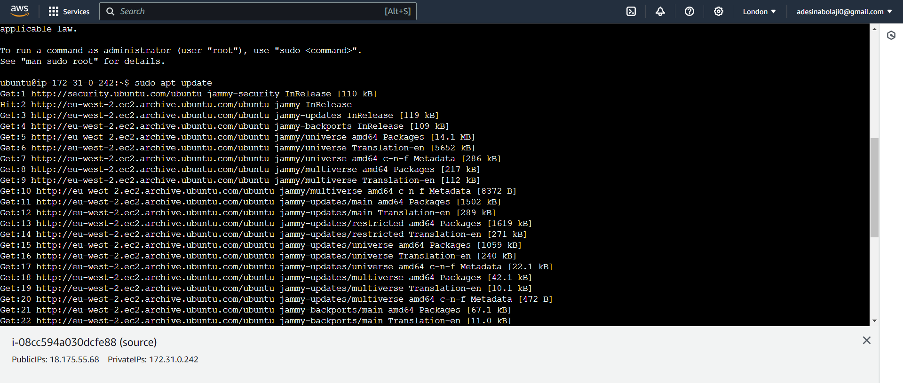

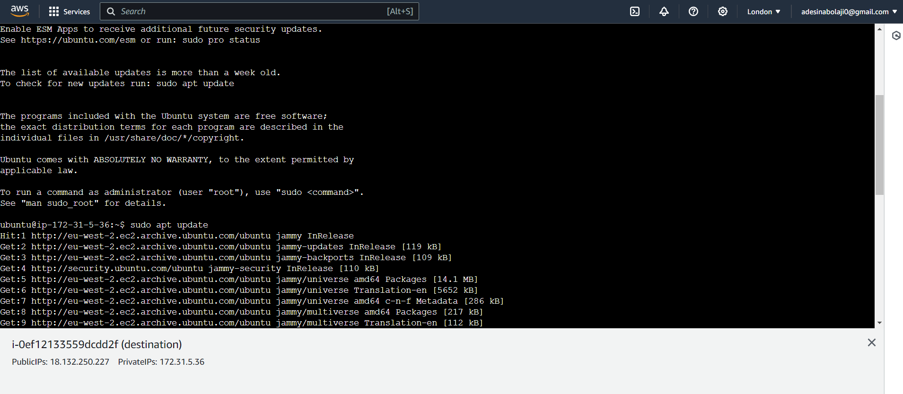

2. Install Rysnc on both servers

    `sudo apt install rsync`

    
    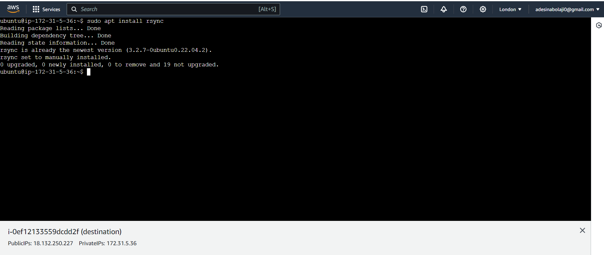

### Step 2 Configure SSH Key-based Authentication:
Set up SSH key-based authentication between the source and destination servers to allow secure communication without password prompts.
The Source server should have the Private key, while the Destination Server should the Public key for before we can successfully SSH from one server into another.

Generate an SSH key pair on the source server 


`ssh-keygen -t rsa`

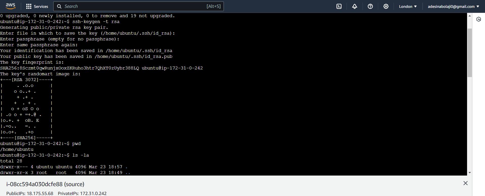

You can use ls -la to check the hidden file (.ssh) that is just created.

Our goal is to copy the public key so generated form the Source server to the Destination server, so as to enable us SSH into the Destination server.

Use ssh-copy-id to copy the public ip to the destination server.
ssh-copy-id username@target_server_ip_address
if the above method doesn't work try copying it manually

cat ~/.ssh/id_rsa.pub

Copy the displayed text

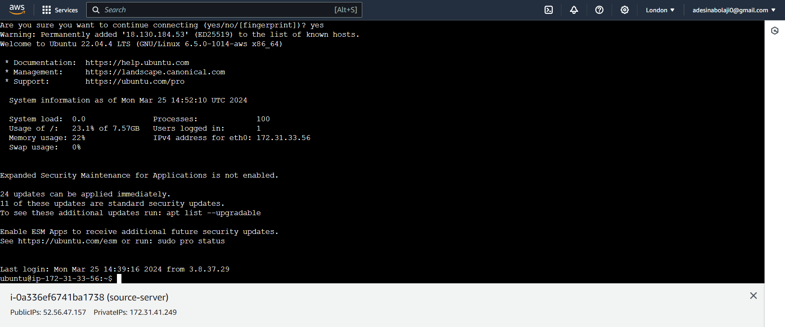

Run the command below in the destination sever

`echo "your_copied_public_key_here" >> ~/.ssh/authorized_keys`

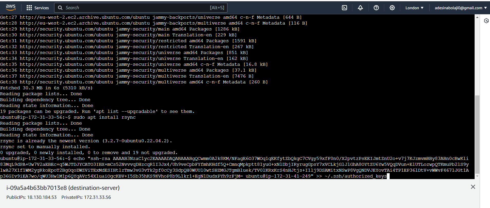

Change permission of authorized_keys

`chmod 600 ~/.ssh/authorized_keys`

Once the public key has been copied try connecting to the destination server using SSH from the source server:
`ssh username@target_server_ip_address`


### Step-3 : Create Backup Script:

- Create a backup script in the source server

```
vi backup.sh
```

The below shall be the content of `backup.sh file`:

```
#!/bin/bash
​
set -x
set -e
​
​
# Define source and destination directories
SRC_DIR="/path/to/source"
DEST_HOST="username@destination_server_ip"
DEST_DIR="/path/to/destination"
​
# Rsync command to synchronize files and directories
rsync -avz --delete $SRC_DIR $DEST_HOST:$DEST_DIR
​
# Check rsync exit status
if [ $? -eq 0 ]; then
    echo "Backup completed successfully."

else
    echo "Backup failed!"

fi
​
```

> Open vim and edit the script.

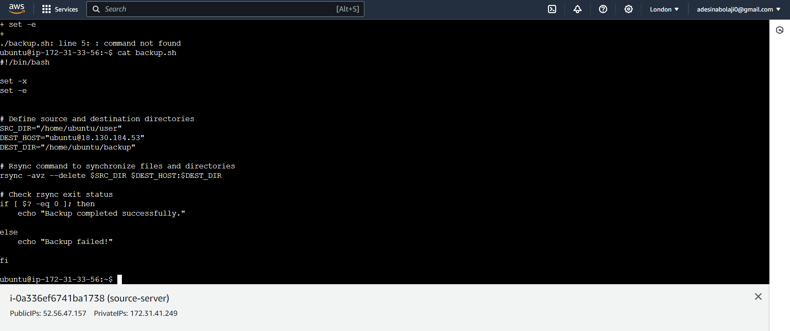

- Here is a basic example don't forget to modify the parameters.

```
#!/bin/bash

set -x
set -e


# Define source and destination directories
SRC_DIR="/path/to/source"
DEST_HOST="username@destination_server_ip"
DEST_DIR="/path/to/destination"

# Rsync command to synchronize files and directories
rsync -avz --delete $SRC_DIR $DEST_HOST:$DEST_DIR

# Check rsync exit status
if [ $? -eq 0 ]; then
    echo "Backup completed successfully."

else
    echo "Backup failed!"

fi

```

- Save the script and exit.

- Make the script executable:

```
chmod +x backup.sh
```

> Create folders and files in the Source folder and run the bash script to back it up.
>
> 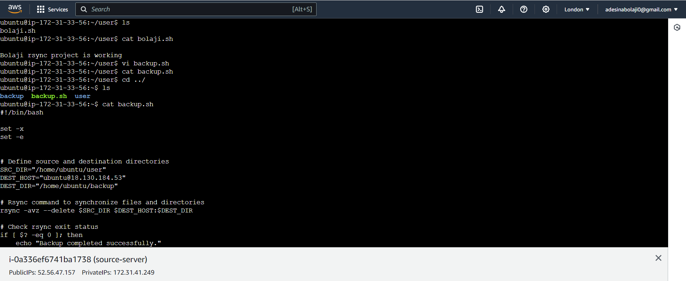

> Backup Successful in Destination server
>
> 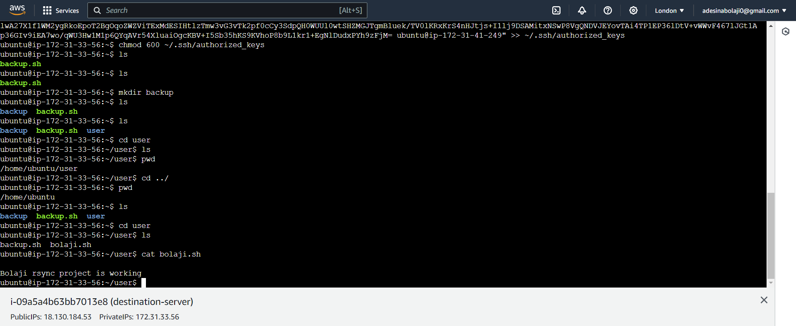

### Step-4 : Schedule Backup with Cron:

- Edit the crontab file to schedule regular backups:

```
crontab -e
```

- Add a cron job to execute the backup script at the desired interval. for every 2hours:

```
0 */2 * * * /path/to/backup.sh
```

`To update a task every 2 minutes using crontab, you can use the following code:`

```
*/2 * * * * /path/to/your/script.sh
```
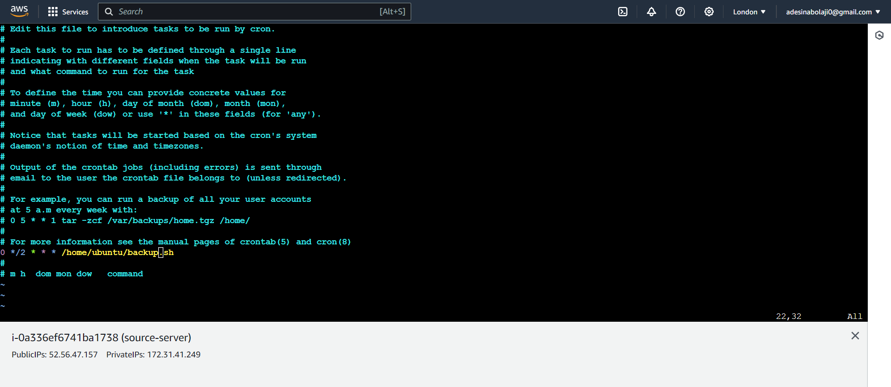
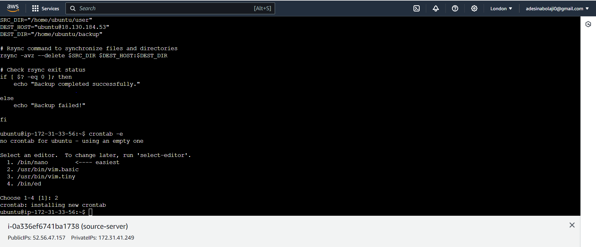